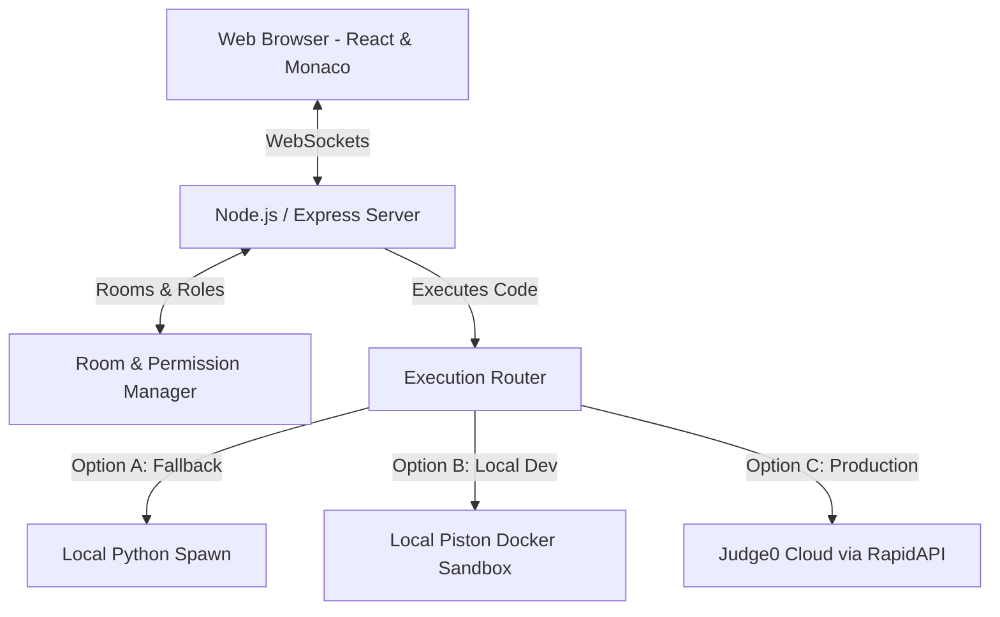

# CodeRoom 🚀

CodeRoom is a modern, lightweight, and highly polished collaborative coding platform designed for pair programming, technical interviews, mock assessments, and mentoring sessions. It provides a distraction-free environment inspired by VS Code and LeetCode, focusing on speed and visual elegance.

---

## Key Features

- **Real-Time Collaboration**: Dynamic, multi-user document synchronization with Monaco Editor, preserving the undo history and keeping typing latency under 100ms.
- **Neon Live Cursors**: Floating cursor indicators showing name tags and selections for multiple editors, matching Google Docs.
- **Role & Permission Management**: Host-controlled participant privileges. Rooms support a maximum of 2 Editors, with all other participants joining as read-only Viewers. Hosts can promote, demote, or kick users in real-time.
- **Synchronized Stopwatch**: Host-controlled timer visible to all participants, helpful for structured mock interviews.
- **Shared Scratchpad**: Auto-saving collaborative notes panel for brainstorming edge cases, complexities, or hint sharing.
- **Secure Code Execution**: Hybrid code runner supporting C++, Java, and Python with compilation diagnostic highlights, runtimes, and execution timeouts.

---

## Architecture Diagram



---

## Tech Stack

### Frontend
- **Framework**: React 19, TypeScript, Vite
- **Styling**: Premium custom Vanilla CSS (glassmorphic dark-first design)
- **Editor**: `@monaco-editor/react` (Monaco Editor wrapper)
- **State Management**: Zustand
- **Real-Time**: Socket.IO Client
- **Icons**: Lucide React

### Backend
- **Runtime**: Node.js
- **Server**: Express
- **Real-Time**: Socket.IO (WebSockets server)

---

## How Code Execution Works in Production (Deployment Strategy)

When deploying this application live to the web, you should follow this deployment structure:

1. **Frontend (Vercel)**:
   - Deploy the `frontend/` folder to **Vercel**. Vercel handles high traffic, serves the static assets with maximum efficiency, and automatically sets up HTTPS.
2. **Backend (Render / Railway / Heroku)**:
   - Deploy the `backend/` folder to a persistent hosting platform (like **Railway** or **Render**). Because the platform relies on WebSockets (`socket.io`), it needs a containerized, persistent Node.js environment (not serverless functions).
3. **Execution Sandbox (Judge0 Cloud / Dedicated Server)**:
   - **Why we don't execute directly in production**: Running untrusted code compiled directly on your web host server is insecure and can expose system keys.
   - **Production Setup**: Register for a free **Judge0** subscription on RapidAPI (which includes 50 free executions/day). Add your RapidAPI key as the `RAPIDAPI_KEY` environment variable in your Render/Railway backend configuration. The server will automatically route all execution securely to Judge0's cloud sandboxes.

---

## Getting Started Locally

### 1. Run the Application
1. **Start the Backend**:
   ```bash
   cd backend
   npm install
   npm start
   ```
2. **Start the Frontend**:
   ```bash
   cd frontend
   npm install
   npm run dev
   ```

### 2. Configure Local Docker Code Execution (Piston)
For C++ and Java execution to work locally without installing compilers on your computer, you can run Piston inside a Docker container:

1. Start Docker Desktop.
2. Spin up the container from the root directory:
   ```bash
   docker-compose up -d
   ```
3. Piston starts with no languages pre-installed. Run the following command to download and set up C++, Java, and Python within the container:
   ```bash
   docker exec -it piston_api cli/index.js ppman install python cpp java
   ```

Once installed, executing Python, Java, and C++ code in CodeRoom will run locally inside the isolated container and return the output!
